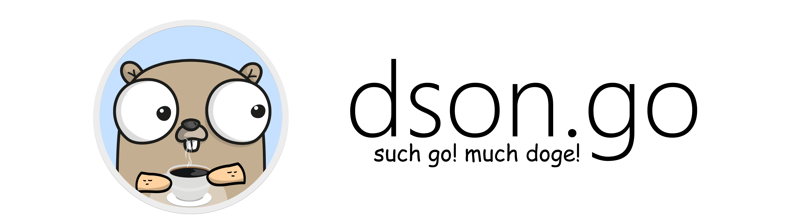

# 

[](https://travis-ci.org/muhammadmuzzammil1998/dson.go) [](https://www.codefactor.io/repository/github/muhammadmuzzammil1998/dsongo) [](https://goreportcard.com/report/github.com/muhammadmuzzammil1998/dson.go) [](https://www.codacy.com/app/muhammadmuzzammil1998/dson.go?utm_source=github.com&utm_medium=referral&utm_content=muhammadmuzzammil1998/dson.go&utm_campaign=Badge_Grade) [](https://codeclimate.com/github/muhammadmuzzammil1998/dson.go/maintainability) [](https://codeclimate.com/github/muhammadmuzzammil1998/dson.go/test_coverage) [](https://github.com/muhammadmuzzammil1998/dson.go/blob/master/LICENSE) [](https://twitter.com/intent/tweet?text=Wow:&url=https%3A%2F%2Fgithub.com%2Fmuhammadmuzzammil1998%2Fdson.go)

**dson.go** provides encoding, decoding, marshaling, unmarshaling, and verification of the DSON (Doge Serialized Object Notation) as defined [here](https://dogeon.xyz/).

## Index

- [Install dson.go](#installing-dsongo-package)
- [Documentation](#documentation)
- [Syntax](#syntax)
- [Examples](#examples)

## Installing dson.go package

```sh
go get muzzammil.xyz/dsongo
```

## Documentation

- [DSON standard](https://dogeon.xyz/)
- [GoDoc for dson.go](https://godoc.org/muzzammil.xyz/dson.go)

## Syntax

DSON is built on two structures:

- A collection of key/value pairs. In various languages, this is realized as an object, record, struct, dictionary, hash table, keyed list, or associative array.

- An ordered list of values. In most languages, this is realized as an array, vector, list, or sequence.

### Keys and Values

A key is a `string` in double quotes.

A value can be a `string` in double quotes, or a `number`, or `yes` or `no` or `empty`, or `an object` or `an array`. These structures can be nested.

```dson
such
  "foo" is "bar"
wow
```

is equivalent to this in JSON:

```json
{
  "foo": "bar"
}
```

### Strings

A string is a sequence of zero or more Unicode characters, wrapped in double quotes, using backslash escapes.

### Numbers

A number is very much like a C or Java number, except it is presented in the dog-friendly octal base.

### Objects

An object begins with `such` and ends with `wow`. Each key is followed by is and the key/value pairs are separated by `,` (comma) or `.` (dot) or `!` or `?`.

```dson
such
  "foo" is "bar",
  "number" is 42!
  "alive" is yes
wow
```

is equivalent to this in JSON:

```json
{
  "foo": "bar",
  "number": 34,
  "alive": true
}
```

### Arrays

An array begins with `so` and ends with `many`. Values are separated by `and` or `also`.

```dson
such
  "ID" is 1!
  "Name" is "Reds".
  "Colors" is so
    "Crimson" and "Red" and "Ruby" also "Maroon"
  many
wow
```

is equivalent to this in JSON:

```json
{
  "id": 1,
  "Name": "Reds",
  "Colors": ["Crimson", "Red", "Ruby", "Maroon"]
}
```

## Examples

### Common imports

```go
import (
    "fmt"

    "muzzammil.xyz/dsongo"
)
```

### Encoding JSON into DSON

```go
func main() {
    d := dson.Encode(`{"foo":"bar"}`)
    fmt.Println(d) // such "foo" is "bar" wow
}
```

### Decoding DSON into JSON

```go
func main() {
    j := dson.Decode(`such "foo" is "bar" wow`)
    fmt.Println(j) // {"foo":"bar"}
}
```

### Validating DSON

```go
func main() {
    if dson.Valid(`such "foo" is "bar" wow`) {
        fmt.Println("Valid DSON")
    } else {
        fmt.Println("Invalid DSON")
    }
}
```

### Marshaling DSON

```go
func main() {
    type ColorGroup struct {
        ID     int
        Name   string
        Colors []string
    }
    RedGroup := ColorGroup{
        ID:     1,
        Name:   "Reds",
        Colors: []string{"Crimson", "Red", "Ruby", "Maroon"},
    }
    r, err := dson.Marshal(RedGroup)
    if err == nil && dson.Valid(r) {
        fmt.Println(r) // such "ID" is 1! "Name" is "Reds". "Colors" is so "Crimson" and "Red" and "Ruby" also "Maroon" many wow
    }
}
```

### Unmarshaling DSON

```go
func main() {
    d := `so such "Name" is "Platypus" and "Order" is "Monotremata" wow and such "Name" is "Quoll" and "Order" is "Dasyuromorphia" wow many`
    if !dson.Valid(d) {
        fmt.Println("DSON is not valid")
        return
    }
    type Animal struct {
        Name  string
        Order string
    }
    var animals []Animal
    err := dson.Unmarshal(d, &animals)
    if err == nil {
        fmt.Printf("%+v", animals) // [{Name:Platypus Order:Monotremata} {Name:Quoll Order:Dasyuromorphia}]
    }
}
```
